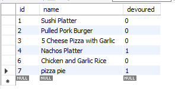

# Food App - Express SQL Handlebars

ThisFood App allows users to enter foods that they fancy adding to their existing list of 'yummy foods' database. Once added to the yummy foods list, the user will be able to update and consume that dish by clicking he 'devour' button which will inturn move it over to the 'devoured foods' list and removing it from the yummy foods list.

## Instillation

Simply go to live site [here](https://quiet-temple-50760.herokuapp.com/view) to see the application in action. If running through a local host, ensure to run npm install to install the necessary node modules. Once installed, simply run npm start to start a localhost. The app uses SQL as a database to allow users to store their lists.

## Usage

once the user enters the site, they can start adding as to the yummy foods list by entering the dish/food into the form area then press the submit button.

Once submitted this will add the entered food into the foods database which as a foods table that has the id of the foods, the foods name, and whether it's been 'devoured' or not. After this, the app model will use orm to access the database to pull the necessary information to populate the page to include the list of foods in the appropriate fields using handlebars.

When the user clicks the devour button on a selected food, this will remove enter into the api which renders the necessary information and then redirects back to the homepage with the item from the yummy foods list and into the devoured foods list.

## Examples

- image 1: Initial homepage
  

- image 3: list of foods
  

- image 4: sql table resource
  
